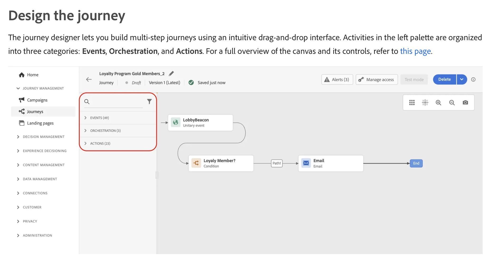

# react-canvas-workflow

A **journey builder** web app: drag nodes from a palette onto a canvas, connect them, edit properties, validate the graph, simulate paths, and export or publish JSON. The UI is built with **React** and **React Flow** (@xyflow/react). Authoring happens entirely in this app; **n8n** is only a **planned runtime target** via a small stub compiler (see [n8n in this project](#n8n-in-this-project)).

> **Status: mid-migration.** This project is being evolved toward an **Adobe Journey Optimizer (AJO)–style** orchestration canvas — see [Product direction: Adobe Journey Optimizer parity](#product-direction-adobe-journey-optimizer-parity) for the target feature set, [Target tech stack migration](#target-tech-stack-migration) for the React/TypeScript/TanStack Query/Zustand/Tailwind plan, and [Gap analysis](#gap-analysis-current-vs-adobe-journey-optimizer) + [Roadmap / TODOs](#roadmap--todos) for what's built vs. what's missing. Read those sections before making changes so new work lands in the right phase.

---

## Tech stack

### Current (as shipped today)

| Layer | Technology |
|--------|------------|
| UI | React 19, TypeScript |
| Graph / canvas | [@xyflow/react](https://reactflow.dev/) v12 (`ReactFlow`, nodes, edges, viewport, controls, minimap) |
| State | Local component state only — `useState` / `useNodesState` / `useEdgesState` inside `FlowCanvas`, plus one React Context (`JourneyValidationContext`) |
| Styling | Hand-written CSS in `index.css` (BEM-ish class names, no design tokens/utility framework) |
| Data fetching | None — everything is synchronous, in-memory, or `localStorage` |
| Build | Vite 6, `@vitejs/plugin-react` |
| Lint | ESLint 9, TypeScript ESLint, React Hooks plugin |

Runtime dependencies are intentionally minimal today: **only** `react`, `react-dom`, and `@xyflow/react`. There is no router, global state library, async data layer, or UI kit.

### Target (Phase 0 complete — see Roadmap below)

| Layer | Technology | Why |
|--------|------------|-----|
| UI | React 19, TypeScript (strict) | Unchanged — already in place |
| Graph / canvas | `@xyflow/react` v12 | Unchanged — keep as the canvas engine |
| **Global / canvas state** | **Zustand** ✅ | `src/store/journeyStore.ts` — nodes/edges/journeyName/viewport/selection/panel widths/undo-redo, replacing the old `useState`/`useNodesState`/`useEdgesState` cluster in `JourneyBuilder.tsx` |
| **Server / async state** | **TanStack Query** ✅ | `src/hooks/queries/useJourneyQueries.ts` over a mock API (`src/lib/api/mockApi.ts`) — journey load/save/publish plus audience/event/template catalogs, still backed by `localStorage` for now |
| **Styling** | **Tailwind CSS** ✅ (partial) | Wired in via `@tailwindcss/vite`; coexists with `index.css` globals today — full utility-class port is incremental (Phase 1+) |
| Forms | (TBD — likely React Hook Form + Zod) | Inspector forms will grow substantially (per-channel schemas); needed for validation ergonomics. |
| Testing | Vitest + React Testing Library ✅ | Configured; baseline coverage on `journeyValidation.ts`, `simulateJourney.ts`, `journeyStore.ts` |

---

## Getting started

```bash
npm install
npm run dev
```

Open the URL Vite prints (usually `http://localhost:5173`).

```bash
npm run build   # production build
npm run lint    # ESLint
```

---

## Project layout

```
src/
├── main.tsx                 # React root
├── App.tsx                  # Renders JourneyBuilder
├── JourneyBuilder.tsx       # Toolbar, FlowCanvas: palette | canvas | inspector, validation wiring
├── index.css                # App styles
├── components/
│   ├── palette/Palette.tsx  # Draggable node types
│   ├── nodes/journeyNodes.tsx  # Custom React Flow nodes (Start, Audience, Event, Email, End)
│   ├── Inspector.tsx        # Selected node property editor
│   ├── PanelResizeHandle.tsx # Resize palette / properties panels
│   ├── ExecutionDryRunModal.tsx
├── context/
│   └── JourneyValidationContext.tsx  # Shares validation result with node components
├── hooks/
│   └── useNodeValidation.ts   # Per-node messages from context (node outline ok/error)
└── lib/
    ├── journeySchema.ts       # Types, JSON parse/serialize, JourneyDocument
    ├── journeyValidation.ts   # Rules + reachability + simulation gate
    ├── simulateJourney.ts     # Path walk for “simulate” / dry run
    ├── publishBundle.ts       # Publish artifact: journey + n8n stub
    ├── adapters/n8n.ts        # Stub: journey → n8n-shaped JSON
    ├── storage.ts             # localStorage autosave, file import/export helpers
    └── panelWidths.ts         # Resizable panel widths persisted locally
```

---

## Main components (roles)

- **`JourneyBuilder`** — Wraps the app in `ReactFlowProvider`. Hosts the toolbar (journey name, New, Import, Export, Simulate path, Dry run, Publish) and **`FlowCanvas`**, which owns all canvas state.
- **`FlowCanvas`** (inside `JourneyBuilder.tsx`) — Holds `nodes` / `edges` via `useNodesState` / `useEdgesState`, selection, debounced autosave, import/export, simulation banners, and the dry-run modal. Wraps content in **`JourneyValidationProvider`** so custom nodes can read validation.
- **`Palette`** — Renders journey node types; drag uses `dataTransfer` with type `application/reactflow`. Drops are handled on the React Flow pane (`onDrop` / `onDragOver`) to create nodes at cursor position.
- **Custom nodes** (`journeyNodes.tsx`) — Map to `nodeTypes` for `start`, `audience`, `event`, `email`, `end`. Each uses **`useNodeValidation`** to show valid vs invalid styling.
- **`Inspector`** — Edits `data` for the selected node when something is selected; hidden when nothing is selected.
- **`PanelResizeHandle`** — Draggable separators between palette, canvas, and inspector; widths clamped and stored (see `lib/panelWidths.ts`).
- **`ExecutionDryRunModal`** — Modal listing simulated steps when validation passes and dry run runs.

---

## Data model

- **`JourneyDocument`** (`lib/journeySchema.ts`): versioned JSON with `meta` (name, updatedAt), `nodes` (React Flow nodes with `JourneyNodeData`), `edges`, optional `viewport`.
- **Node types**: `start`, `audience`, `event`, `email`, `end` — each has a `label`; optional fields include `subtitle`, `segmentHint`, `eventKey`, `templateName` depending on type.

The canvas is the source of truth while editing; snapshots go to **`toJourneyDocument`** for export, publish, and autosave.

---

## Execution flow (behavior)

1. **Authoring** — Users add nodes (palette drag or existing graph), connect edges (`onConnect`, `onReconnect`), pan/zoom. Viewport changes trigger debounced save.
2. **`validateJourney`** (`lib/journeyValidation.ts`) — Enforces:
   - Exactly one **Start** and one **End** node
   - Unique non-empty **labels**
   - Required fields per type (e.g. segment hint, event key, template name)
   - All nodes **reachable** from Start
   - If Start and End are unique, **`simulateJourney`** must complete successfully (single coherent path in the simulator’s sense)
3. **`simulateJourney`** (`lib/simulateJourney.ts`) — Walks from Start; at branches, sorts targets by id and follows the **first** (with warnings if multiple outgoing edges). Detects cycles and dead ends.
4. **Dry run** — When validation passes, opens **`ExecutionDryRunModal`** with the same simulation result (preview only; no external systems).
5. **Export** — Downloads journey JSON (`serializeJourney`), gated on full validity in the UI.
6. **Autosave** — `lib/storage.ts` writes the journey to `localStorage` under `journey-builder:last` (debounced).

---

## n8n in this project

**n8n is not installed or executed by this app.** It is modeled as a **future deployment/runtime**:

- **`lib/adapters/n8n.ts`** — Exports `journeyToN8nWorkflow(journey)`. Today this returns a **stub** object (minimal `name`, empty `nodes` / `connections`, `meta.template: "journey-to-n8n-stub"`). The intent is that a later **compiler** turns a `JourneyDocument` into real n8n workflow JSON while **authoring stays in React**.
- **`lib/publishBundle.ts`** — **Publish** builds a JSON bundle containing:
  - the full **`journey`** document, and
  - **`n8nWorkflow`** from `journeyToN8nWorkflow`.

So: **authoring** = this UI; **running in production** = envisioned as importing the published bundle into n8n (or similar) once the adapter is implemented — not using n8n’s own visual editor as the source of truth.

---

## Local storage keys

| Key | Purpose |
|-----|--------|
| `journey-builder:last` | Last autosaved journey JSON |
| `journey-builder:palette-width` | Palette panel width |
| `journey-builder:inspector-width` | Properties panel width |

---

## Product direction: Adobe Journey Optimizer parity

Reference: [Create your first journey — Adobe Journey Optimizer](https://experienceleague.adobe.com/en/docs/journey-optimizer/using/orchestrate-journeys/create-journey/journey-gs)

AJO frames journey building as four stages, each with specific concepts this app should mirror:

1. **Create** — define journey properties (name, description, priority/frequency-capping-style settings) before touching the canvas.
2. **Design** — a palette split into three categories (**Events**, **Orchestration**, **Actions**), an entry point (audience- or event-based), branching/condition/wait activities, and channel actions (email, push, SMS, in-app, web, code-based, content card).
3. **Test** — three distinct validation modes: **Simulation** (temporary synthetic users), **Test mode** (persistent test profiles), and **Dry run** (real production data, no real sends).
4. **Publish** — journeys can't publish with errors; once live, they're monitored via reporting.

### Entry-point model (AJO)

| AJO entry type | Behavior | Current app equivalent |
|---|---|---|
| Read Audience | Batch audience, scheduled or one-shot | ❌ none — `audience` node exists but is a mid-journey node, not a true entry point with scheduling |
| Audience Qualification | Real-time, profile enters/exits a streaming audience | ❌ none |
| Unitary event | Real-time, one profile per trigger | Partial — `event` node exists but isn't scoped as an entry type |
| Business event | Non-profile event fanning out to many profiles via implicit Read Audience | ❌ none |

### Palette categories (AJO)

- **Events** (entry + mid-journey signals)
- **Orchestration** (Condition, Wait, Jump / sub-journey linking)
- **Actions** (Email, Push, SMS, In-app, Web, Code-based experience, Content card, Custom action)

The current app's palette is flat (`start`, `audience`, `event`, `email`, `end`) with no category grouping and no branching primitive at all.

---

## UI layout reference (target)

Based directly on the AJO screenshot below, the target shell has **two distinct layout levels** that this app currently conflates/omits. This is scoped down from full AJO chrome — we are **not** rebuilding the entire admin console, only the pieces needed to frame the journey canvas.



### 1. Outer app shell — left nav rail

AJO's left rail has many sections (Home, Campaigns, Journeys, Landing pages, Decision Management, Experience Decisioning, Content Management, Data Management, Connections, Customer, Privacy, Administration). **For this app, scope the left rail down to a single item: `Journeys`.** No other nav sections should be built now — they're explicitly out of scope until/unless a later phase calls for them.

- [ ] Add an `AppShell` component with a slim left nav rail
- [ ] Only nav item: **Journeys** (active/selected state) — everything else omitted, not just hidden
- [ ] Journeys click → journey list (already partially planned in Phase 5) or directly into the journey editor for now

### 2. Journey editor header (above the canvas)

Matches the screenshot's top bar: back arrow, editable journey name (pencil icon), status row (`Journey` label · `Draft` · `Version 1 (Latest)` · save indicator, e.g. "Saved just now"), and right-aligned actions (`Alerts (n)`, `Manage access`, `Test mode`, `Delete`, primary action dropdown, info icon).

- [ ] Add a `JourneyEditorHeader` component reflecting: journey name (editable inline), draft/published status, version label, autosave status text (replace the current toolbar bar in `JourneyBuilder.tsx`)
- [ ] Right-side action cluster: Alerts (validation error/warning count — can source from `journeyValidation.ts` `global`/`byNode` counts), Test mode toggle, Delete, primary publish action
- [ ] Not all of these need to be functional immediately — stub non-critical ones (e.g. "Manage access") behind disabled state so the layout matches without over-building

### 3. Palette panel — accordion, not a flat list

This is the key structural change to `Palette.tsx`. Per the screenshot, the palette is a **search + filter bar** above a set of **collapsible accordion groups**, each showing a count and expanding to individual draggable items:

```
[ 🔍 Search...            ] [ ⚗ filter ]
> EVENTS (49)
> ORCHESTRATION (3)
> ACTIONS (23)
```

**Scope decision for this app (per current direction): only two accordion groups for now — `Events` and `Actions`.** Orchestration (Condition/Wait/Jump) stays tracked as a Phase 2 roadmap item (see above) but is **not** a palette accordion group yet — do not add an empty "Orchestration" accordion ahead of having orchestration node types to put in it.

- [ ] Rebuild `Palette.tsx` as an accordion (`Events` / `Actions`), each collapsible independently, each showing an item count in its header (e.g. `EVENTS (2)`, `ACTIONS (1)` — counts reflect whatever node types actually exist today, not AJO's real numbers)
- [ ] Add a search input above the accordion that filters items across both groups by label (client-side filter over the palette's static item list — no backend needed)
- [ ] Nest existing node types under the right group: `audience`/`event` → **Events**; `email` → **Actions**. `start`/`end` are structural, not palette-draggable in AJO's model — keep them as an implicit canvas anchor rather than a palette entry, or place them in a small separate non-accordion section if a palette entry is still wanted
- [ ] Each accordion item shows an icon + label + one-line subtitle (matching the canvas node card style, e.g. "LobbyBeacon / Unitary event") — reuse the same icon/label pairing between palette item and the node rendered on canvas for visual consistency

### 4. Canvas node cards

Note from the screenshot that canvas nodes render as a small card: icon (colored chip) + bold title (the instance name, e.g. "LobbyBeacon") + gray subtitle (the type, e.g. "Unitary event"). Condition nodes additionally show a labeled path segment (`Path1`) on the outgoing edge before it reaches the next action. Track this as a visual-parity item for `journeyNodes.tsx` once Phase 2/3 node types land — current node cards already follow a similar title/subtitle pattern, so this is a styling refinement (Tailwind tokens), not a structural change.

---

## Gap analysis: current vs. Adobe Journey Optimizer

| Area | AJO capability | This app today | Gap |
|---|---|---|---|
| Journey properties | Dedicated config pane (name, description, priority, etc.) before design | Only a free-text journey name in the toolbar | **Large** — no properties panel/model |
| Entry points | 4 distinct types (Read Audience, Audience Qualification, Unitary event, Business event), each with its own config UI | Single generic `audience`/`event` node, not distinguished as "entry" | **Large** |
| Orchestration | Condition (branching), Wait (delay), Jump (sub-journey) | None. `simulateJourney` explicitly treats >1 outgoing edge as a warning and just picks one path — branching is actively unsupported | **Critical** — this is the biggest structural gap |
| Actions / channels | Email, Push, SMS, In-app, Web, Code-based, Content card, Custom action | Only `email` (as a generic node with a template-name string) | **Large** |
| Palette organization | 3 categories (Events / Orchestration / Actions) | Flat, uncategorized list of 5 node types | Medium |
| Validation | Errors block publish; validation is channel/activity-aware | Structural validation exists (`journeyValidation.ts`): single start/end, unique labels, required fields, reachability, path simulation — solid foundation, but no per-channel schema validation | Medium (extend, don't replace) |
| Testing | 3 modes: Simulation (synthetic users), Test mode (persistent test profiles), Dry run (real prod data, no sends) | One mode: `simulateJourney` walks a single deterministic path; `ExecutionDryRunModal` just displays that path. No profile concept, no "modes" distinction | **Large** |
| Publish | Blocked on errors; produces a live, monitored journey | `publishBundle.ts` builds a JSON bundle (journey + n8n stub) gated on validity — good pattern, but nothing "goes live" or is monitored | Medium |
| Reporting | Dedicated analytics/reporting views per journey | None | **Large** (likely out of scope for near-term phases; see Non-goals) |
| Data model | Journeys reference real Audiences, Events, Data Sources, Custom Actions as first-class configured entities | `JourneyNodeData` is a flat bag of optional strings (`segmentHint`, `eventKey`, `templateName`) with no linkage to any catalog of audiences/events/templates | **Large** |
| State management | N/A (product concern only) | Everything lives in local `useState` inside a 769-line `JourneyBuilder.tsx`; no undo/redo, no cross-component store | Architectural — blocks the above cleanly |
| Async data | N/A (product concern only) | No data-fetching layer at all; autosave is synchronous `localStorage` | Architectural — needed once audiences/events/templates become "real" entities to fetch |
| Styling system | N/A (product concern only) | Hand-written global CSS, no tokens/utilities | Architectural — needed to scale node/panel visual variety (8+ action types, 3 palette categories, condition branches) |

---

## Roadmap / TODOs

Phased so each phase ships something usable. Architecture work (Phase 0) is front-loaded because branching, new node types, and async data all get much harder to retrofit later.

### Phase 0 — Foundations (tech stack migration, no new product features) ✅ implemented
- [x] Add Tailwind CSS (`@tailwindcss/vite`, `@import "tailwindcss"` in `index.css`) — coexists with the existing hand-written CSS for now, per the "keep visual output ~identical" plan; porting individual rules to utilities is incremental, ongoing work
- [x] Add Zustand — `src/store/journeyStore.ts` now owns `nodes`, `edges`, `journeyName`, `viewport`, `selectedId`, panel widths, and undo/redo history; `FlowCanvas` (in `JourneyBuilder.tsx`) reads/writes it via selectors instead of local `useState`/`useNodesState`/`useEdgesState`
- [x] Add TanStack Query + `QueryClientProvider` at the app root (`main.tsx`)
- [x] Build a mock API module (`src/lib/api/mockApi.ts`) exposing `fetchJourney`, `saveJourney`, `publishJourney`, `fetchAudiences`, `fetchEvents`, `fetchMessageTemplates` — wrapped by query/mutation hooks in `src/hooks/queries/useJourneyQueries.ts`. Journey load/save still persists to `localStorage` under the hood (via the existing `lib/storage.ts` helpers) so behavior is unchanged; swapping in a real backend later only touches this one file.
- [x] Move autosave from a raw debounced `localStorage` write to a debounced `useSaveJourneyMutation().mutate(...)` call; Publish goes through `usePublishJourneyMutation()`
- [x] Add Vitest + React Testing Library; baseline tests written for `journeyValidation.ts`, `simulateJourney.ts` (pure functions), and the new `journeyStore.ts` (hydration, undo/redo, edit-session dirty-tracking) — 18 tests, all passing
- [x] Introduce undo/redo — implemented at the store level, scoped to **structural** edits (add/delete node or edge, connect, reconnect, and a single commit when the Inspector is saved/closed). Field-by-field undo while a panel is open is intentionally out of scope for now (see note in `journeyStore.ts`) — one undo step reverts "the edit session," not every keystroke.

Verified: `npx tsc -b`, `npm run build`, `npm run lint`, and `npm run test` all pass clean as of this phase.

### Phase 1 — Journey properties + entry points + shell layout ✅ implemented
- [x] Add a **Journey Properties** panel (name + description), toggled from the header's ⓘ icon. Scope decision: entry-type selection is *not* in this panel — in AJO's actual model the entry point is the first canvas activity (dragged from the Events palette), not a properties-dialog field, so putting it in both places would just create two conflicting ways to set the same thing. See `JourneyPropertiesPanel.tsx`.
- [x] Extended `JourneyNodeType` with `entry-read-audience`, `entry-audience-qualification`, `entry-unitary-event`, `entry-business-event` (`journeySchema.ts`). One `EntryNode` component renders all four (`journeyNodes.tsx`), reusing the existing `segmentHint`/`eventKey` data fields rather than inventing new ones. Old `"start"` node type is kept as a recognized-but-deprecated literal — `parseJourney` migrates it to `entry-unitary-event` on load, so previously saved/exported journeys keep working.
- [x] `journeyValidation.ts` / `simulateJourney.ts` now key off `isEntryNodeType()` instead of `type === "start"`: exactly one entry point required, **and it must have no incoming edges** (new rule), plus per-kind required fields (audience for the two audience-based entries, event for the two event-based entries).
- [x] Built the **UI layout reference (target)**: `AppShell` (`Journeys`-only left nav rail), `JourneyEditorHeader` (name, Draft/Version/saved status, Alerts count wired to real validation output, stubbed-and-disabled Manage access / Test mode, working Delete), and the accordion `Palette.tsx` (`Events` / `Actions` groups + search, with `End` pinned separately as structural, matching the "not a palette concept in AJO's own model" note). These are new Tailwind-based components; the old dark `.app-toolbar` CSS is kept for the secondary "authoring tools" row (Import/Export/Simulate/Dry run/Publish/Undo/Redo/Zoom) since those aren't part of AJO's actual chrome.

Verified: `npx tsc -b`, `npm run build`, `npm run lint`, and `npm run test` all pass (21 tests) as of this phase.

Known scope gaps carried forward on purpose (not silently dropped):
- Palette item counts are real-but-small (6 Events, 1 Actions) since only a handful of node types exist yet — they'll grow as Phase 2/3 add Orchestration and more channels.
- The "Back" arrow and "Manage access" in the header are visual-only; there's no journey list to go back to yet (that's a Phase 5 item) and no multi-user model in this tool.
- Entry-node icons/colors are a first pass, not a pixel-accurate match to the screenshot.

### Phase 2 — Orchestration primitives (branching)
- [ ] Add a **Condition** node type supporting multiple named outgoing branches (e.g. "Yes"/"No" or rule-based splits) — this is the single highest-value gap since `simulateJourney` currently can't express branching at all
- [ ] Rework `simulateJourney` to walk **all** branches (tree/DAG traversal) instead of "first edge wins," returning a set of possible paths instead of one
- [ ] Add a **Wait** node type (fixed delay or wait-until-event) — purely modeled/validated client-side (no real scheduler needed for the authoring tool)
- [ ] Add a **Jump** node type referencing another journey document, per AJO's sub-journey pattern
- [ ] Update `journeyValidation.ts` reachability + "single coherent path" rule to account for legitimate multi-branch graphs (a valid journey may have several End nodes reachable via different conditions)

### Phase 3 — Channel actions
- [ ] Generalize the single `email` node into an **Action** node family: Email, Push, SMS, In-app, Web, Code-based experience, Content card, Custom action — each with its own `data` schema (extend `JourneyNodeData` via a discriminated union keyed on channel)
- [ ] Per-channel Inspector forms (template/subject for Email, message body for SMS/Push, custom payload for Custom action)
- [ ] Per-channel required-field validation rules in `journeyValidation.ts`

### Phase 4 — Testing modes
- [ ] Rename/reframe the existing dry-run flow as **Simulation** (synthetic user, structural walk) — closest existing analog
- [ ] Add a **Test mode** concept: a small set of mock "test profiles" (fetched via TanStack Query from the mock API) that get walked through the graph, surfacing which branch each profile takes
- [ ] Add a **Dry run** mode that's explicitly labeled as "no real sends" and reuses production-shaped mock data
- [ ] Make `ExecutionDryRunModal` mode-aware (title/copy changes per mode) rather than one fixed "dry run" label

### Phase 5 — Publish & monitoring (stretch)
- [ ] Extend `publishBundle.ts` / `lib/adapters/n8n.ts` from a stub into a real compiler once node types stabilize (Phases 1–3)
- [ ] Add a minimal "journey list" view (TanStack Query `listJourneys`) so publish has somewhere to go besides a JSON download
- [ ] Stretch: a placeholder reporting view (static/mock metrics) — explicitly lower priority than authoring/testing fidelity

### Non-goals (near-term)
- Real backend/persistence beyond a mock API layer — this stays a front-end authoring tool
- Real message delivery (email/SMS/push sending) — out of scope entirely
- Full AJO reporting/analytics fidelity — a mock placeholder at most
- Multi-user collaboration/permissions

---

## License

Private / project-specific — add a `LICENSE` file if you need to publish terms.
